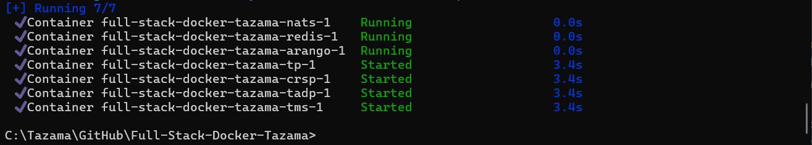
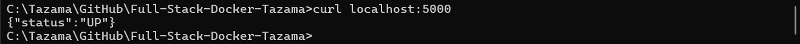
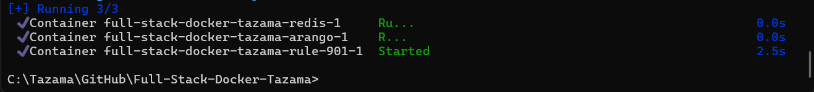
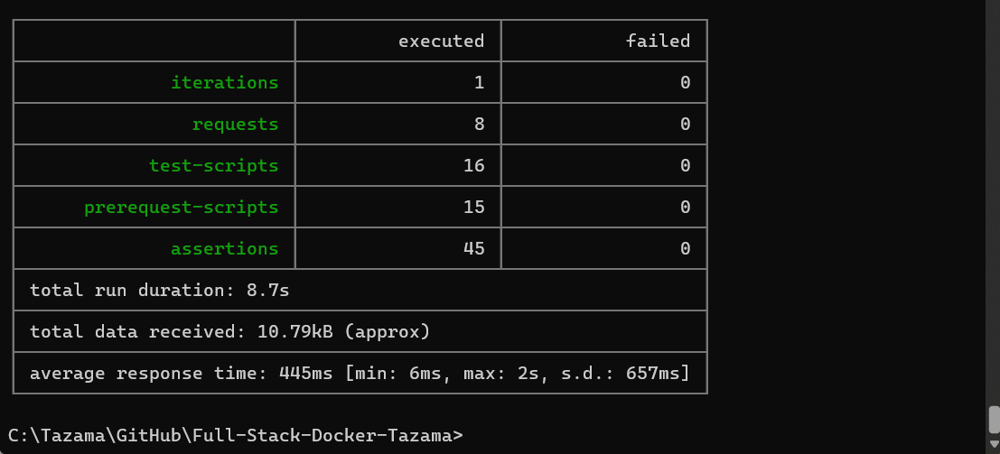

<!-- SPDX-License-Identifier: Apache-2.0 -->


  - [INTRODUCTION](#introduction)
  - [Pre-requisites:](#pre-requisites)
  - [INSTALLATION STEPS](#installation-steps)
  - [1. Clone the Full-Stack-Docker-Tazama Repository to Your Local Machine](#1-clone-the-full-stack-docker-tazama-repository-to-your-local-machine)
  - [2. Update the Full-Stack-Docker-Tazama Configuration Files](#2-update-the-full-stack-docker-tazama-configuration-files)
  - [3. Deploy the Core Services](#3-deploy-the-core-services)
  - [4. Configure Tazama](#4-configure-tazama)
  - [5. Deploy core processors](#5-deploy-core-processors)
  - [6.  Compose the rule processor](#6--compose-the-rule-processor)
  - [TESTING THE END-TO-END DEPLOYMENT](#testing-the-end-to-end-deployment)
- [TROUBLESHOOTING TIPS](#troubleshooting-tips)
  - [Appendix](#appendix)
  - [Configure Tazama](#configure-tazama)


## INTRODUCTION

This guide will show you how to install the platform using only the publicly available open source software components, in a Docker container on a single local Windows machine via Docker Compose.

This guide is specific to the Windows 10 or 11 operating system.

## Pre-requisites:

Set up your development environment as recommended in the [Tazama Contribution Guide](../Community/Tazama-Contribution-Guide.md#32-setting-up-the-development-environment).

The pre-requisites that are essential to be able to follow this guide to the letter are:

 - Docker Desktop for Windows (and WSL)
 - Git
 - Newman
 - A code editor (this guide will assume you are using VS Code)
  - A GitHub personal access token with `packages:read` permissions
   - Ensure that your GitHub Personal Access Token is added as a Windows Environment Variable called "`GH_TOKEN`".
   - Instructions for creating the GH_TOKEN environment variable can be found in the [Tazama Contribution Guide (A. Preparation)](https://github.com/frmscoe/docs/blob/main/Community/Tazama-Contribution-Guide.md#a-preparation)

     - We will be referencing your GitHub Personal Access Token throughout the installation process as your `GH_TOKEN`. It is not possible to retrieve the token from GitHub after you initially created it, but if the token had been set in Windows as an environment variable, you can retrieve it with the following command from a Windows Command Prompt:

        ```
        set GH_TOKEN
        ```

## INSTALLATION STEPS

## 1. Clone the Full-Stack-Docker-Tazama Repository to Your Local Machine

In a Windows Command Prompt, navigate to the folder where you want to store a copy of the source code. For example, the source code root folder path I have been using to compile this guide is C:\Tazama\GitHub. Once in your source code root folder, clone the repository with the following command:

```
git clone https://github.com/frmscoe/Full-Stack-Docker-Tazama -b main
```

**Output:**


## 2. Update the Full-Stack-Docker-Tazama Configuration Files

First, we want to create the basic environment variables to guide the Docker Compose installation.

Navigate to the Full-Stack-Docker-Tazama folder and launch VS Code:

**Output:**


In VS Code, open the .env file in the Full-Stack-Docker-Tazama folder and update the `.env` file as follows:

 - (Optional) If your GitHub Personal Access Token had not been added as a Windows Environment Variable, you would need to specify the token at the top of the file next to the GH_TOKEN key. If you had specified the GH_TOKEN as an environment variable, you can leave the `${GH_TOKEN}` shell variable in place to retrieve it automatically.
 - (Optional) If you prefer an alternative port for the Transaction Monitoring Service API, you can update the `TMS_PORT` environment variable.

The current unaltered `.env` file will look as follows:

```javascript
# Authentication
GH_TOKEN=${GH_TOKEN}

# Branches
TMS_BRANCH=main
ED_BRANCH=main
TP_BRANCH=main
TADP_BRANCH=main
RULE_901_BRANCH=main

# Ports
TMS_PORT=5000

# TLS
NODE_TLS_REJECT_UNAUTHORIZED='0'
```

## 3. Deploy the Core Services

Tazama core services provides the foundational infrastructure components for the platform and includes the ArangoDB, NATS and redis services: ArangoDB provides the database infrastructure, NATS provides the pub/sub functionality and redis provides for fast in-memory processor data caching.

We deploy these services first and separately so that we can access the database to configure Tazama before continuing with the rest of the installation tasks.

First, start the Docker Desktop for Windows application.

With Docker Desktop running: from your Windows Command Prompt and from inside the `Full-Stack-Docker-Tazama` folder, execute the following command:

```
docker compose up -d arango redis nats
```

**Output:**


You'll be able to access the web interfaces for the deployed components through their respective TCP/IP ports on your local machine as defined in the `docker-compose.yaml` file.

 - ArangoDB: <http://localhost:18529>
 - NATS: <http://localhost:18222>

If your machine is open to your local area network, you will also be able to access these services from other computers on your network via your local machine's IP address.

## 4. Configure Tazama

Tazama is configured by loading the network map, rules and typology configurations required to evaluate a transaction via the ArangoDB API. The steps above have already loaded the default configuration into the database.

For an optional step to load the Tazama configuration manually, follow the instructions in the  [Appendix](#appendix)

## 5. Deploy core processors

Now that the platform is configured, we can deploy our core processors. The main reason the configuration needs to preceed the deployment of the processors is that the processors read the network map at startup to set up the NATS pub/sub routes for the evaluation flow. If the core processors were deployed first, they would have to be restarted once the configuration was eventually uploaded.

Navigate back to the `full-stack-docker-tazama` folder:
```
cd Full-Stack-Docker-Tazama
```

Execute the following command to deploy the core processors:

```
docker compose up -d tms ed tp tadp
```


This command will install:

 - The Transaction Monitoring Service API at `<https://localhost:5000>`, where messages will be sent for evaluation. 
 - The Event Director that will handle message routing based on the network map
 - The Typology Processor that will summarise rule results into scenarios according to invidual typology configurations
 - The Transaction Aggregation and Decisioning Processor that will wrap up the evaluation of a transaction and publish any alerts for breached typologies

**Output:**




You can test that the TMS API was successfully deployed with the following command from the Command Prompt:

```
curl localhost:5000
```

**Output:**



## 6.  Compose the rule processor

Navigate back to the `Full-Stack-Docker-Tazama` folder, and run the command:

```
docker compose up -d rule-901
```

**Output:**



## TESTING THE END-TO-END DEPLOYMENT

Now, if everything went according to plan, you'll be able to submit a test transaction to the Transaction Monitoring Service API and then be able to see the result of a complete end-to-end evaluation in the database. 

If you have not already done so, clone the postman repository. In a Windows Command Prompt, navigate to the source code root folder. Then clone the postman repository with the following command:
```
git clone https://github.com/frmscoe/postman -b main
```

**Output:**


We can run the following Postman test via Newman to see if our deployment was successful:

```
newman run collection-file -e environment-file --timeout-request 10200 --delay-request 500
```

 - The `collection-file` is the full path to the location on your local machine where the `postman\1.1. Rule-901 End-to-End test - pain001-013 disabled.postman_collection.json` file is located.
 - The `environment-file` is the full path to the location on your local machine where the `postman\environments\Tazama-Docker-Compose-LOCAL.postman_environment.json` file is located.
 - If the path contains spaces, wrap the string in double-quotes.
 - We add the `--delay-request` option to delay each individual test by 500 milliseconds to give them evaluation time to complete before we look for the result in the database.

**Output:**



# TROUBLESHOOTING TIPS

Start/Restart individual services with
`docker compose up -d --force-recreate <service>`    

Try running following if changes are not reflecting  
`docker compose up -d --build --force-recreate`  

You can trash your container followed by deleting the image in docker if none of the above works.  

Stopping individual (or multiple) services  
`docker compose down <service> <service2> <service3>`

List of \<services\>  
- arango  
- redis  
- nats  
- tms   
- ed  
- tadp  
- tp  
- rule-901  

## Appendix

This appendix will show you how to optionally load the configuration and environment files in the Tazama full stack docker deployment.

In a Windows Command Prompt, navigate to the source code root folder. Then clone the following repository with the following command:
```
git clone https://github.com/frmscoe/postman -b main
```

**Output:**


Perform the following Newman command to load the configuration into the ArangoDB databases and collections:

```
newman run collection-file -e environment-file --timeout-request 10200
```

 - The `collection-file` is the full path to the location on your local machine where the `postman\Configuration - Rule 901.postman_collection.json` file is located.
 - The `environment-file` is the full path to the location on your local machine where the `postman\environments\Tazama-Docker-Compose-LOCAL.postman_environment.json` file is located.
 - If the path contains spaces, wrap the string in double-quotes.

**Output:**

 

