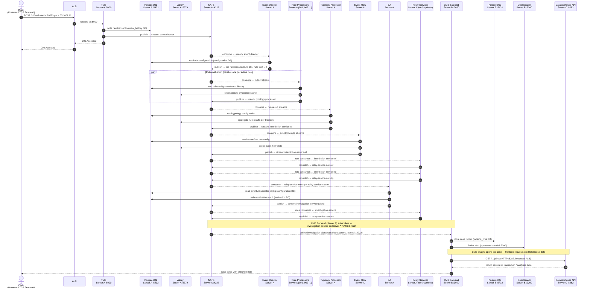
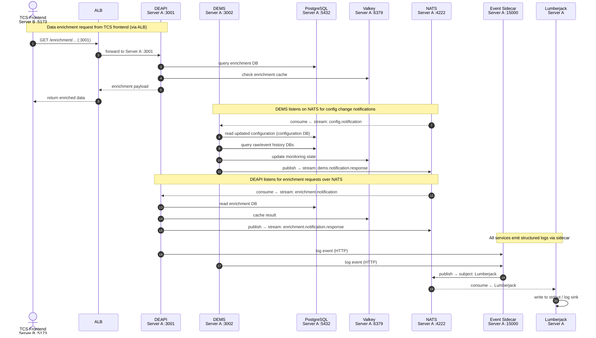
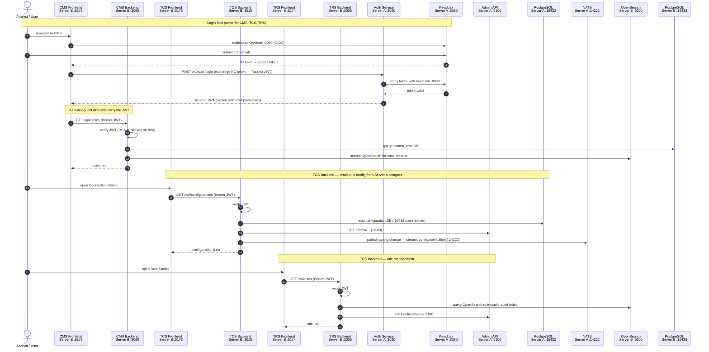
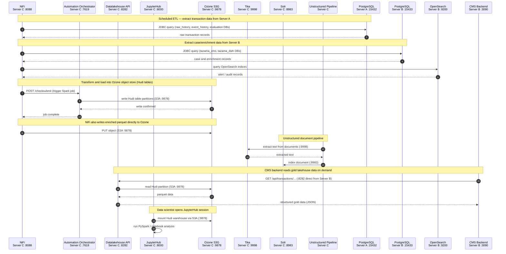
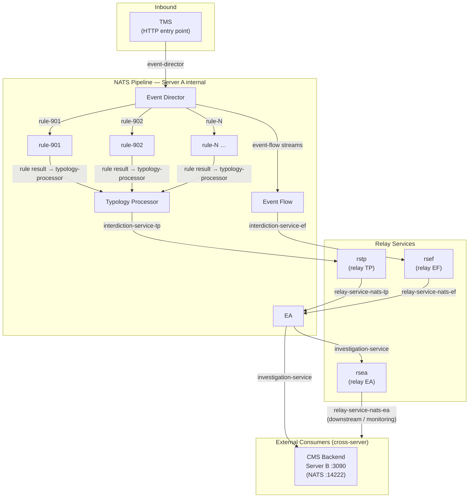

# End-to-End Service Flow

This document maps all inter-service communication across the three-server Tazama AWS
deployment. Each section below covers a distinct data path or functional area.

| Server | Hostname | Private IP | Stack |
|---|---|---|---|
| Server A | `core.tazama.internal` | `10.0.1.10` | tazama-core |
| Server B | `extensions.tazama.internal` | `10.0.1.20` | tazama-extensions |
| Server C | `biar.tazama.internal` | `10.0.1.30` | tazama-biar |

---

## 1. System Architecture Overview

All three servers sit in a private subnet with no public IPs. User traffic enters via the
Application Load Balancer (public subnet). Operator SSH access uses the EC2 Instance Connect
Endpoint (EICE) — no port 22 exposed to the internet.

```mermaid
flowchart TD
    Client(["Browser / API Client"])
    SFTPc(["SFTP Client"])
    Operator(["Operator / Workstation"])

    subgraph ALBsg["ALB — public subnet"]
        ALB["Application Load Balancer\nPort-based HTTP (Phase E)\nHTTPS :443 (Phase F)"]
    end

    subgraph SA["Server A — core.tazama.internal — 10.0.1.10"]
        TMS["TMS :5000"]
        Admin["Admin API :5100"]
        Auth["Auth Service :3020"]
        KC["Keycloak :8080"]
        DEAPI["DEAPI :3001"]
        DEMS["DEMS :3002"]
        PGA["pgAdmin :5050"]
        Hasura["Hasura :6100"]
        NATS_A[("NATS\n:4222 / ext :14222")]
        PG_A[("PostgreSQL\n:5432 / ext :15432")]
        VK[("Valkey\n:6379 / ext :16379")]
        PIPELINE["NATS Pipeline\nED → Rules → TP / EF / EA"]
        RS["Relay Services\nrsef · rstp · rsea"]
        Logging["Event Sidecar :15000\n+ Lumberjack"]
    end

    subgraph SB["Server B — extensions.tazama.internal — 10.0.1.20"]
        TCSfe["TCS Frontend :5173"]
        TCSbe["TCS Backend :3010"]
        TRSfe["TRS Frontend :5174"]
        TRSbe["TRS Backend :3005"]
        CMSfe["CMS Frontend :5175"]
        CMSbe["CMS Backend :3090"]
        Voila["Voila :18866"]
        PGB["pgAdmin-ext :5051"]
        PG_B[("PostgreSQL\n:5432 / ext :15433")]
        OS[("OpenSearch :9200")]
        CDB[("CouchDB :5984")]
        FLW["Flowable :8080"]
        SFTP["SFTP :12222"]
    end

    subgraph SC["Server C — biar.tazama.internal — 10.0.1.30"]
        NiFi["NiFi :8088"]
        AO["Automation Orchestrator :7619"]
        DLH["Datalakehouse API :8282"]
        JH["JupyterHub :8000"]
        UP["Unstructured Pipeline"]
        Tika["Tika :9998"]
        Solr["Solr :8983 (tunnel only)"]
        Ozone["Ozone Cluster\nS3G :9878 · SCM :9876\nOM :9862 · Recon :9888\nDatanodes ×3"]
    end

    EICE(["EICE Endpoint\n(no port 22 in any SG)"])

    %% ── External ingress ──────────────────────────────────────────────────
    Client -- "HTTP / HTTPS" --> ALB
    SFTPc -- "SFTP :12222" --> SFTP
    Operator -- "SSH via EICE" --> EICE
    EICE -- ":22 (SG only)" --> SA
    EICE -- ":22 (SG only)" --> SB
    EICE -- ":22 (SG only)" --> SC

    %% ── ALB → Server A ───────────────────────────────────────────────────
    ALB -- ":5000" --> TMS
    ALB -- ":5100" --> Admin
    ALB -- ":3020" --> Auth
    ALB -- ":8080" --> KC
    ALB -- ":3001" --> DEAPI
    ALB -- ":3002" --> DEMS
    ALB -- ":5050" --> PGA
    ALB -- ":6100" --> Hasura

    %% ── ALB → Server B ───────────────────────────────────────────────────
    ALB -- ":5173" --> TCSfe
    ALB -- ":3010" --> TCSbe
    ALB -- ":5174" --> TRSfe
    ALB -- ":3005" --> TRSbe
    ALB -- ":5175" --> CMSfe
    ALB -- ":3090" --> CMSbe
    ALB -- ":5051" --> PGB

    %% ── ALB → Server C ───────────────────────────────────────────────────
    ALB -- ":8088" --> NiFi
    ALB -- ":8000" --> JH
    ALB -- ":7619 (listener only)" --> AO
    ALB -- ":8282 (listener only)" --> DLH

    %% ── Server A internal ────────────────────────────────────────────────
    TMS -- "event-director" --> NATS_A
    NATS_A -- "pipeline" --> PIPELINE
    PIPELINE -- "investigation-service" --> NATS_A
    NATS_A -- "relay streams" --> RS
    DEAPI --- NATS_A
    DEMS --- NATS_A
    PIPELINE --- PG_A
    PIPELINE --- VK
    TMS --- PG_A
    TMS --- VK
    DEAPI --- PG_A
    DEAPI --- VK
    DEMS --- PG_A
    DEMS --- VK
    PIPELINE -- "sidecar" --> Logging
    TMS -- "sidecar" --> Logging

    %% ── Server B → Server A (cross-server) ───────────────────────────────
    TCSbe -- "postgres :15432" --> PG_A
    TCSbe -- "NATS :14222" --> NATS_A
    TCSbe -- "auth :3020" --> Auth
    TCSbe -- "keycloak :8080" --> KC
    TCSbe -- "admin :3100" --> Admin
    TRSbe -- "auth :3020" --> Auth
    TRSbe -- "admin :3100" --> Admin
    CMSbe -- "auth :3020" --> Auth
    CMSbe -- "NATS :14222" --> NATS_A
    CMSbe -- "valkey :16379" --> VK

    %% ── Server B internal ────────────────────────────────────────────────
    TCSbe --- OS
    TCSbe --- SFTP
    TRSbe --- OS
    CMSbe --- PG_B
    CMSbe --- OS
    CMSbe --- CDB
    CMSbe --- FLW
    FLW --- PG_B

    %% ── Server B → Server C (direct — bypasses ALB) ──────────────────────
    CMSbe -- "direct :8282" --> DLH

    %% ── Server C → Server A (ETL cross-server) ───────────────────────────
    NiFi -- "postgres ETL :15432" --> PG_A
    NiFi -- "NATS :14222" --> NATS_A

    %% ── Server C → Server B (ETL cross-server) ───────────────────────────
    NiFi -- "postgres ETL :15433" --> PG_B
    NiFi -- "opensearch :9200" --> OS

    %% ── Server C internal ────────────────────────────────────────────────
    NiFi --- Ozone
    AO --- Ozone
    DLH --- Ozone
    JH --- Ozone
    UP --- Tika
    UP --- Solr
    NiFi -- ":7619" --> AO
```

---

## 2. Transaction Processing Pipeline

The core Tazama flow: a financial message is submitted to the TMS, fanned out through the
NATS-based rule evaluation pipeline, decisioned by the Event Adjudicator, and the resulting investigation alert is consumed by the CMS on Server B.

DEAPI and DEMS run inside the `tazama-core` Docker project on **Server A** (launched as a
pre-flight step for extensions) so they share the internal Docker network with NATS, postgres,
and valkey. Their exterior ports (:3001, :3002) allow external callers (Server B frontends
via ALB) to reach them across the network.

---

## 3. Data Enrichment and Event Monitoring (DEAPI / DEMS)

DEAPI and DEMS are both co-hosted on **Server A** (tazama-core project). They are called by
frontends via the ALB and by the NATS pipeline for enrichment callbacks.

---

## 4. Tooling Frontend Authentication and API Flows

TCS, TRS, and CMS frontends follow the same auth pattern: the frontend requests a JWT from
the Auth Service (via the TMS auth endpoint or Keycloak), then the backend validates the JWT
locally using the RSA public key.

---

## 5. BIAR Data Pipeline (NiFi ETL and Analytics)

NiFi orchestrates data movement between Server A's PostgreSQL, Server B's PostgreSQL and
OpenSearch, and the Ozone object store on Server C. The Datalakehouse API exposes the processed
(gold) data to the CMS backend.

---

## 6. Cross-Server Connection Reference

All ports listed here traverse the AWS VPC private subnet (`10.0.1.0/24`). They require the
corresponding Security Group ingress rules to be in place.

### Server B → Server A

| Source service | Destination | Port | Protocol | Purpose |
|---|---|---|---|---|
| tcs-backend | PostgreSQL (Server A) | 15432 | TCP/JDBC | Read rule configuration DB |
| tcs-backend | Auth Service | 3020 | TCP/HTTP | JWT validation |
| tcs-backend | NATS | 14222 | TCP/NATS | Publish config.notification |
| tcs-backend | Keycloak | 8080 | TCP/HTTP | OIDC token verification |
| tcs-backend | Admin API | 3100 | TCP/HTTP | Admin operations |
| trs-backend | Auth Service | 3020 | TCP/HTTP | JWT validation |
| trs-backend | Admin API | 3100 | TCP/HTTP | Admin operations |
| cms-backend | Auth Service | 3020 | TCP/HTTP | JWT validation |
| cms-backend | NATS | 14222 | TCP/NATS | Subscribe: investigation-service |
| cms-backend | Valkey | 16379 | TCP/RESP | Redis cache |

### Server B → Server C

| Source service | Destination | Port | Protocol | Purpose |
|---|---|---|---|---|
| cms-backend | Datalakehouse API | 8282 | TCP/HTTP | Gold lakehouse data (direct, not via ALB) |

### Server C → Server A

| Source service | Destination | Port | Protocol | Purpose |
|---|---|---|---|---|
| NiFi | PostgreSQL (Server A) | 15432 | TCP/JDBC | ETL extraction (raw_history, event_history, evaluation) |
| NiFi | NATS | 14222 | TCP/NATS | Pipeline integration |

### Server C → Server B

| Source service | Destination | Port | Protocol | Purpose |
|---|---|---|---|---|
| NiFi | PostgreSQL (Server B) | 15433 | TCP/JDBC | ETL extraction (tazama_cms, tazama_dwh) |
| NiFi | OpenSearch | 9200 | TCP/HTTP | ETL extraction (alert / audit indices) |

### ALB → Servers (per-server, current port-based HTTP routing)

> Ports with `†` have ALB listener target groups configured but the port is **not** currently
> open in the ALB Security Group — those services are accessed via SSH tunnel (Phase E.1).
> They will be opened to the internet when promoted to Phase F subdomain routing.

| Target | Port | Service |
|---|---|---|
| Server A | 5000 | TMS API |
| Server A | 3001 | DEAPI |
| Server A | 3002 | DEMS |
| Server A | 3020 | Auth Service |
| Server A | 5100 | Admin API |
| Server A | 8080 | Keycloak |
| Server A | 5050 | pgAdmin (core) |
| Server A | 6100 | Hasura |
| Server B | 3005 | TRS Backend |
| Server B | 3010 | TCS Backend |
| Server B | 3090 | CMS Backend |
| Server B | 5051 | pgAdmin (extensions) |
| Server B | 5173 | TCS Frontend |
| Server B | 5174 | TRS Frontend |
| Server B | 5175 | CMS Frontend |
| Server C | 8088 | NiFi UI |
| Server C | 8000 `†` | JupyterHub |
| Server C | 7619 `†` | Automation Orchestrator |
| Server C | 8282 `†` | Datalakehouse API |

### Operator-only (SSH tunnel via EICE, no SG inbound rules)

| Server | Port | Service |
|---|---|---|
| Server B | 18866 | Voila (CMS notebook server) |
| Server C | 8983 | Solr UI |
| Server C | 9876 | Ozone SCM |
| Server C | 9878 | Ozone S3G |
| Server C | 9888 | Ozone Recon UI |

---

## 7. NATS Stream Map (Server A)

The full NATS message path through the Server A pipeline for a single transaction evaluation.

